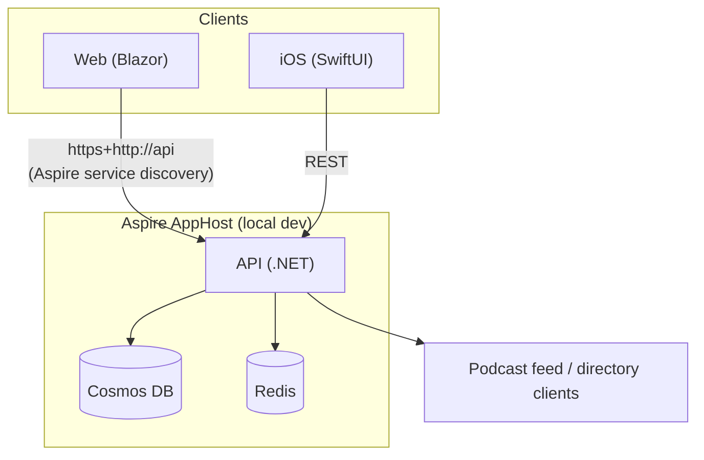
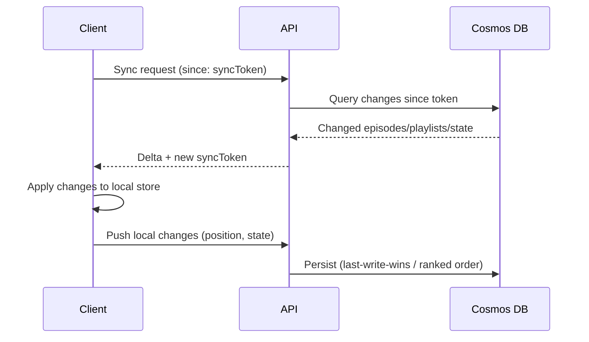

# Kuulla

A podcast app built for audio quality and fast syncing, with web and iOS interfaces.

## Goals

- **Audio quality first** — prioritize high-bitrate streams, gapless playback, and proper audio normalization
- **Fast syncing** — playback position, subscriptions, and queue sync instantly across devices
- **Cross-platform** — native iOS app and a web interface sharing the same backend

## Tech Stack

| Layer | Technology |
|-------|-----------|
| Backend | .NET (C#) |
| Web Frontend | Blazor |
| iOS | Swift |
| Local Dev | .NET Aspire |
| Cloud | Azure |

## Architecture

- **Backend (.NET)** — API for sync, feed management, and audio delivery
- **Web (Blazor)** — browser-based player and subscription management
- **iOS (Swift)** — native app with background audio, offline support, and system integration
- **Aspire** — local development orchestration and service defaults



### Sync model

Playback position, subscriptions, episode state, and playlists all sync through the same
token-based reconciliation pattern: each client tracks a sync token, asks the API for changes
since that token, applies them locally, and pushes its own local changes back up. Playback
position uses last-write-wins; playlists use a rank-based ordering so reordering merges cleanly
across devices.



## Features

### Shipped

- **Subscriptions** — subscribe/unsubscribe to shows, synced across web and iOS
- **Library** — home screen with a show grid and a playlist shelf
- **Show detail** — per-show episode list with filters, sort, and progress indicators
- **Unplayed tracking** — unplayed badges across Library, Subscriptions, and New Episodes
- **Auto-played episodes** — episodes beyond a configurable unlistened-episode limit are
  automatically marked played, are hidden from New Episodes, and can be restored
- **Playlists** — manual, multi-show, reorderable playlists (create, rename, add/remove/reorder
  items), synced across devices
- **Up Next queue** — a dedicated reorderable playback queue spanning multiple shows
- **User settings** — configurable unlistened-episode limit and other per-user preferences
- **Fast, conflict-aware sync** — token-based delta sync for episode state, subscriptions, and
  playlists (see above)

### Planned

Features common in mature podcast apps that aren't built yet, roughly in the order we're
considering them:

```mermaid
graph LR
    A[Smart / auto-updating playlists] --> B[Playback speed & pitch control]
    B --> C[Silence trimming & volume boost]
    C --> D[Sleep timer]
    D --> E[Chapter markers & episode artwork]
    E --> F[Full-text transcripts & search]
    F --> G[Discovery / trending shows]
    G --> H[Cross-device playback handoff]
    H --> I[Offline downloads]
```



- **Smart playlists** — rule-based playlists that auto-populate (e.g. "unplayed, newest first,
  across subscribed shows") instead of manual curation
- **Playback speed & pitch correction** — per-show variable playback speed without pitch
  distortion
- **Silence trimming & volume boosting** — audio post-processing to tighten pacing and
  normalize loud/quiet segments
- **Sleep timer** — stop playback after a duration or at the end of the current episode
- **Chapter markers** — jump to embedded chapter points with per-chapter artwork/links
- **Transcripts & search** — searchable episode transcripts, surfaced in the player
- **Discovery** — trending/recommended shows and curated categories, distinct from
  directory search
- **Cross-device handoff** — seamlessly continue playback mid-episode when switching devices,
  building on the existing sync layer
- **Offline downloads** — download episodes for offline playback on iOS

## Development

### Prerequisites

- .NET 9+ SDK
- .NET Aspire workload
- Xcode (for iOS development)

### Running locally

```sh
dotnet run --project src/Kuulla.AppHost
```

To seed the local dev user's library with 5 real podcasts (instead of starting from an empty
library), start the `seed-dev-data` resource from the Aspire dashboard once `api` is healthy.

## Deployment

Hosted on Azure. Infrastructure and deployment details TBD.

## License

TBD
