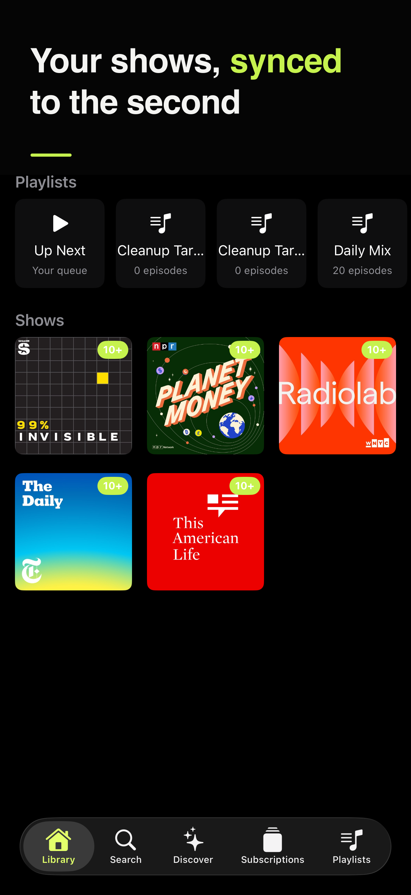
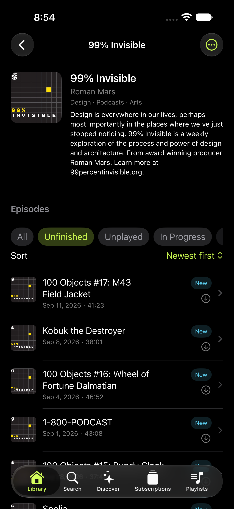
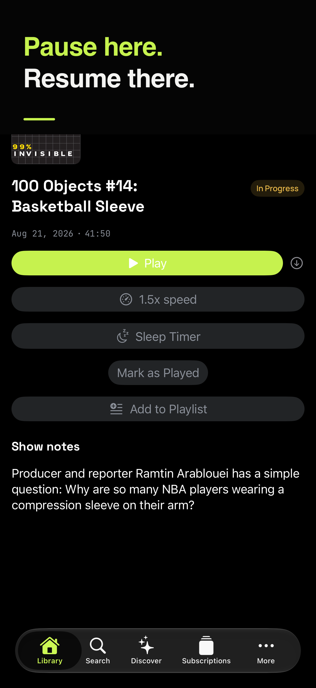
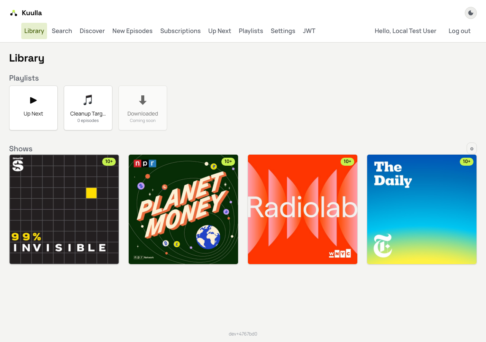
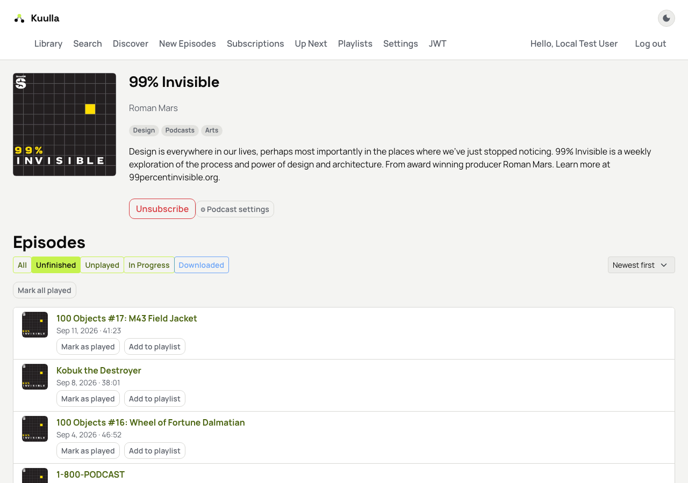
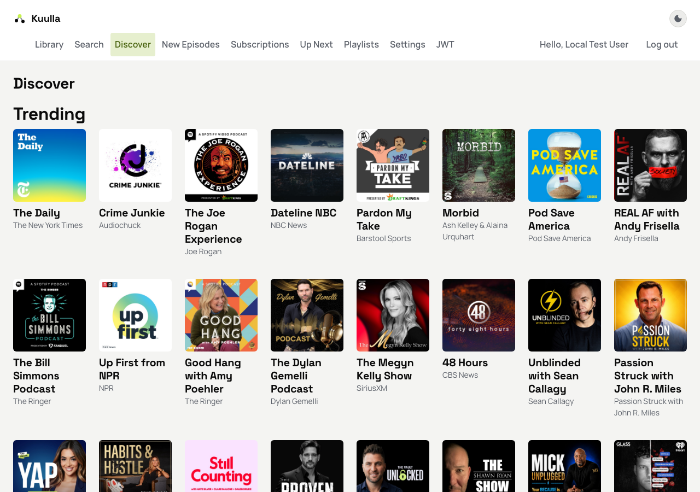
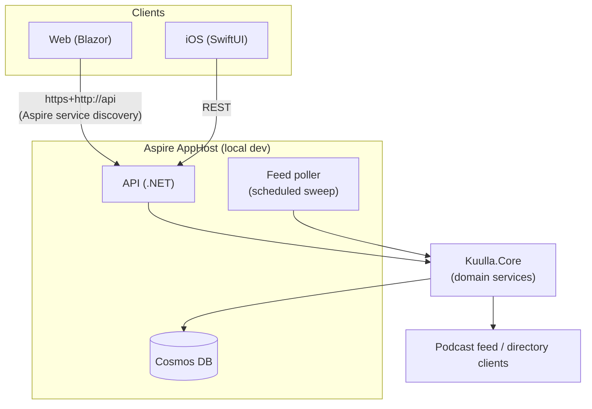
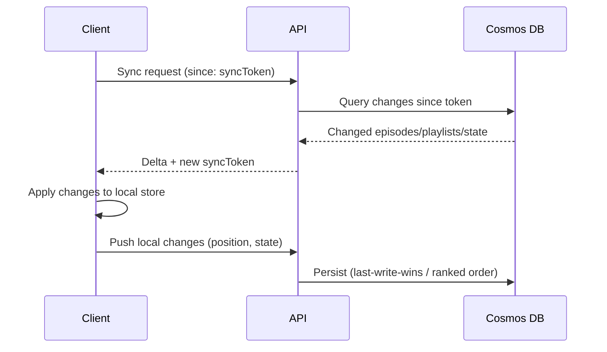
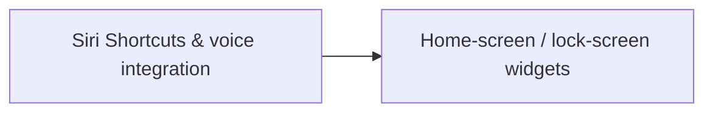

# Kuulla

A podcast app built for audio quality and fast syncing, with web and iOS interfaces.

**iOS**

<table>
<tr>
<td align="center" width="33%">
<br>
<sub>Library — shows, playlists, and Up Next in one screen</sub>
</td>
<td align="center" width="33%">
<br>
<sub>Show detail — episode list with filters and sort</sub>
</td>
<td align="center" width="33%">
<br>
<sub>Now Playing — playback controls, speed, sleep timer, and show notes</sub>
</td>
</tr>
</table>

**Web**

<table>
<tr>
<td align="center" width="33%">
<br>
<sub>Library — the same synced shows and playlists, in the browser</sub>
</td>
<td align="center" width="33%">
<br>
<sub>Show detail — episode list and playback, no app install needed</sub>
</td>
<td align="center" width="33%">
<br>
<sub>Discover — browse trending shows and categories</sub>
</td>
</tr>
</table>

## Goals

- **Audio quality first** — prioritize high-bitrate streams, gapless playback, and proper audio normalization
- **Fast syncing** — playback position, subscriptions, and queue sync instantly across devices
- **Cross-platform** — native iOS app and a web interface sharing the same backend

## Tech Stack

| Layer | Technology |
|-------|-----------|
| Backend | .NET (C#) |
| Web Frontend | Blazor |
| iOS | Swift |
| Local Dev | .NET Aspire |
| Cloud | Azure |

## Architecture

- **Backend (.NET)** — API for sync, feed management, and audio delivery
- **Domain layer (`Kuulla.Core`)** — shared domain services (episodes, shows, subscriptions,
  settings, episode state, device tokens, feed polling, podcast directory/feed clients, the
  SSRF-guarded resource fetcher) referenced by both the API and the feed poller
- **Feed poller** — dedicated worker that sweeps subscribed shows for new episodes on a fixed
  schedule, independent of API replica count (local: an Aspire `PeriodicTimer` worker;
  production: an Azure Container Apps scheduled job)
- **Web (Blazor)** — browser-based player and subscription management
- **iOS (Swift)** — native app with background audio, offline downloads, CarPlay, and other
  system integration
- **Aspire** — local development orchestration and service defaults



### Sync model

Playback position, subscriptions, episode state, and playlists all sync through the same
token-based reconciliation pattern: each client tracks a sync token, asks the API for changes
since that token, applies them locally, and pushes its own local changes back up. Playback
position uses last-write-wins; playlists use a rank-based ordering so reordering merges cleanly
across devices. The iOS app additionally keeps a local read-through cache of shows, subscriptions,
and episodes so the library paints instantly on launch, with sync running on demand rather than
continuously in the foreground.



## Features

### Shipped

- **Subscriptions** — subscribe/unsubscribe to shows, synced across web and iOS
- **OPML import & export** — bring your library over from another podcast app by uploading an OPML
  file (web or iOS); shows you already follow are skipped. Export your subscriptions back out as
  OPML the same way.
- **Library** — home screen with a show grid and a playlist shelf
- **Show detail** — per-show episode list with filters, sort, and progress indicators
- **Unplayed tracking** — unplayed badges across Library, Subscriptions, and New Episodes
- **Auto-played episodes** — episodes beyond a configurable unlistened-episode limit are
  automatically marked played, are hidden from New Episodes, and can be restored
- **Playlists** — manual, multi-show, reorderable playlists (create, rename, add/remove/reorder
  items), plus rule-based smart/dynamic playlists that auto-populate, synced across devices
- **Up Next queue** — a dedicated reorderable playback queue spanning multiple shows
- **Discovery** — curated categories and trending/recommended shows, distinct from directory search
- **Transcripts & search** — searchable episode transcripts, surfaced in the player, with chapter
  markers for jumping to embedded chapter points
- **Playback speed & pitch correction** — per-show variable playback speed without pitch distortion
- **SmartSpeed** — combined silence trimming and volume boosting to tighten pacing and normalize
  loud/quiet segments
- **Sleep timer** — stop playback after a duration or at the end of the current episode
- **Cross-device handoff** — resume playback where you left off when switching between web and iOS
- **Offline downloads (iOS)** — download episodes for offline playback, with configurable
  auto-download and storage/retention rules
- **CarPlay (iOS)** — browse and play from the car's screen
- **User settings** — configurable unlistened-episode limit, playback, downloads/storage, and
  other per-user preferences, synced across devices
- **Fast, conflict-aware sync** — token-based delta sync for episode state, subscriptions, and
  playlists (see above)

### Planned

Remaining pieces of the app-settings and system-integration surface:



- **Siri Shortcuts & voice integration (iOS)** — voice-driven playback control via App Intents
- **Widgets (iOS)** — home-screen and lock-screen widgets for Now Playing / Up Next

## Development

### Prerequisites

- .NET 10 SDK
- .NET Aspire workload
- Xcode (for iOS development)

### Running locally

```sh
aspire run
```

To seed the local dev user's library with 5 real podcasts (instead of starting from an empty
library), start the `seed-dev-data` resource from the Aspire dashboard once `api` is healthy.

See [CLAUDE.md](CLAUDE.md) for the full command reference, including running the iOS app on a
physical device (needed for CarPlay testing).

### Design system

Web and iOS share a single visual identity ("Signal") — true-black, monospace-tagged, with sync
state shown rather than hidden. See [docs/brand.md](docs/brand.md) for the full design system and
[docs/brand/appstore/](docs/brand/appstore/) for App Store assets.

### Docs

- [Settings architecture](docs/settings-architecture.md) — IA and data model for the app-settings
  surface, with per-category specs (playback, downloads/storage, data usage, accessibility,
  appearance, account/privacy, Siri/Shortcuts, widgets, OPML import/export)
- [Sync conventions](docs/sync-conventions.md) — the token-based delta sync pattern used across
  domains
- [Feed poller runbook](docs/feed-poller-runbook.md) — how the scheduled feed sweep works and how
  to operate it
- [CarPlay entitlement runbook](docs/carplay-entitlement-runbook.md) — verification checklist for
  the CarPlay audio entitlement
- [SmartSpeed spike](docs/smartspeed-spike.md) — silence-trim/volume-boost implementation options

## Deployment

Hosted on Azure Container Apps. Merges to `main` do not deploy; a release is cut by pushing a
CalVer tag (`vYYYY.M.N`) with `scripts/new-release.sh`, which publishes a GitHub Release and
deploys the tagged commit.

- [Release runbook](docs/release-runbook.md) — versioning scheme, cutting a release, release
  notes, hotfixes, rollback.
- [Deployment runbook](docs/deployment-runbook.md) — how the ACA deployment behaves
  (scale-to-zero, telemetry, known gaps).

## License

TBD
